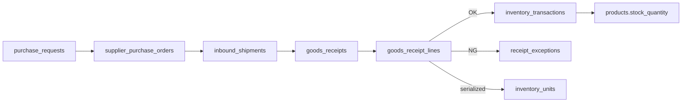
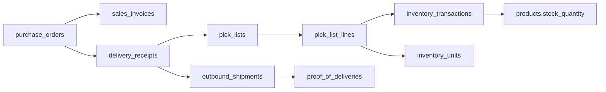

# Phase 9: WMS Process Flow Schema

Maps the **Inbound Purchasing** and **Outbound Ordering & Delivery** diagrams to PostgreSQL entities in Equinox Synergy.

## Terminology

| Diagram | Equinox table | Notes |
|---------|---------------|-------|
| Customer Order | `purchase_orders` | Dealer-facing name stays "Purchase Order"; internally this is a **Sales Order (SO)** |
| Sales Order (SO) | `purchase_orders` + `order_items` | Created when dealer submits cart |
| Purchase Request (PR) | `purchase_requests` | Internal employee requisition |
| PO (to supplier) | `supplier_purchase_orders` | Inbound procurement — not dealer POs |
| Goods Receipt | `goods_receipts` | Warehouse receiving & validation |
| Inventory Available | `products.stock_quantity` | **Cached balance** synced from `inventory_transactions` |
| Invoice | `sales_invoices` | Outbound billing document |
| DR / Withdrawal | `delivery_receipts` | Authorizes warehouse release |
| Picking & Loading | `pick_lists` | Warehouse pick workflow |
| Trucking | `outbound_shipments` | Carrier, vehicle, route |
| POD | `proof_of_deliveries` | Customer sign-off |

---

## Inbound flow (diagram steps 1–9)

| Step | Diagram action | Table(s) | Key fields |
|------|----------------|----------|------------|
| 1 | Purchase Request | `purchase_requests`, `purchase_request_lines` | `pr_number`, `status`, `requested_by`, lines: `product_id`, `quantity_requested` |
| 2 | Purchase Order | `supplier_purchase_orders`, `supplier_order_lines` | `spo_number`, `supplier_id`, optional `purchase_request_id`, `status` |
| 3 | Supplier Dispatch | `inbound_shipments` | `carrier`, `tracking_number`, `shipped_at` |
| 4 | Logistics Arrangement | `inbound_shipments` | Same record; tracking updates |
| 5 | Incoming Delivery | `goods_receipts` | `status = draft`, validate docs |
| 6 | Warehouse Receiving | `goods_receipt_lines` | `quantity_received`, `condition` |
| 6′ | Resolve Issue (NG) | `receipt_exceptions` | `exception_type`, `resolution_status` |
| 8 | Goods Receipt Confirmation | `goods_receipts` | `status → posted`, `received_by`, `posted_at` |
| 9 | Inventory Update | `inventory_transactions` | `txn_type = receive`, triggers stock sync |

**Posting a goods receipt** calls `post_goods_receipt(receipt_id)` which:
1. Inserts `inventory_transactions` (type `receive`) per accepted line
2. Creates `inventory_units` when serial numbers are supplied
3. Updates `products.stock_quantity` via trigger

---

## Outbound flow (diagram steps 1–8)

| Step | Diagram action | Table(s) | Key fields |
|------|----------------|----------|------------|
| 1 | Customer Order | `purchase_orders` | Dealer cart submission (existing) |
| 2 | Sales Order + inventory check | `purchase_orders`, `order_items` | Server validates stock; optional `inventory_transactions` type `reserve` |
| 3 | Invoice | `sales_invoices` | `invoice_number`, `amount`, `status` |
| 4 | DR / Withdrawal | `delivery_receipts` | `dr_number`, `authorized_by`, `status` |
| 5 | Picking & Loading | `pick_lists`, `pick_list_lines` | `quantity_picked`, optional `inventory_unit_id` |
| 6 | Trucking Details | `outbound_shipments` | `trucker_name`, `vehicle_plate`, `route_notes` |
| 7 | Dispatch & Delivery | `outbound_shipments` | `dispatched_at`, `delivered_at`, `status` |
| 8 | Proof of Delivery | `proof_of_deliveries` | `signed_by`, `signed_at`, optional signature file |

**Posting a pick list** calls `post_pick_list(pick_list_id)` which:
1. Inserts `inventory_transactions` (type `ship`) per picked line
2. Marks linked `inventory_units` as `shipped`
3. Releases any `reserve` transactions tied to the sales order

---

## Inventory ledger (center node)

`inventory_transactions` is the **source of truth** for stock movement. `products.stock_quantity` remains as a denormalized cache for fast catalog queries and backward compatibility with Phase 4–8 code.

| `txn_type` | When | `quantity_delta` |
|------------|------|------------------|
| `receive` | Goods receipt posted | positive |
| `ship` | Pick list posted / order fulfilled | negative |
| `reserve` | Sales order confirmed | 0 (tracked separately*) |
| `release` | Order cancelled | 0 |
| `adjust` | Manual correction | +/- |
| `return_in` | Customer return | positive |
| `return_out` | Return to supplier | negative |

\* Reservations are recorded as transactions with `quantity_delta = 0` and a companion `reserved_quantity` field on the row, or as separate reserve/release pairs. Phase 9 uses paired `reserve` / `release` rows with negative/positive semantics on a `quantity` column where `quantity_delta` for reserve stores the reserved amount as metadata — see migration function docs.

**Recommended evolution:** Phase 9 UI should write adjustments through `inventory_transactions` instead of editing `stock_quantity` directly.

---

## Serial / model tracking

| Level | Location | Purpose |
|-------|----------|---------|
| Catalog | `products.model` | Default model name on SKU master |
| Unit | `inventory_units` | Unique `serial_number`, status lifecycle, linked to receipt line and optionally order line |

Serial numbers are **assigned at goods receipt** (inbound step 8), not on the product master alone.

---

## RLS summary

| Domain | Dealer access | Employee access |
|--------|---------------|-----------------|
| Inbound (PR, SPO, receipts) | None | Full CRUD |
| `inventory_transactions` | None | Read + insert via posting functions |
| `inventory_units` | None | Full CRUD |
| Outbound docs (invoice, DR, POD) | Read own order's documents | Full CRUD |
| `suppliers` | None | Full CRUD |

Dealer `purchase_orders` policies are unchanged from Phase 2.

---

## Phase 9 implementation slices

Recommended build order (each slice = roadmap task):

1. **9.1** — Suppliers + inventory ledger + stock sync trigger
2. **9.2** — Purchase requests → supplier POs
3. **9.3** — Inbound shipments + goods receipt posting
4. **9.4** — Receipt exceptions (NG path)
5. **9.5** — Sales invoices + delivery receipts
6. **9.6** — Pick lists + outbound shipments + POD
7. **9.7** — Serial unit tracking at receipt and pick
8. **9.8** — Admin UI for inbound/outbound pipelines

Migration file: `supabase/migrations/20250618000000_phase9_wms_flow_schema.sql`
